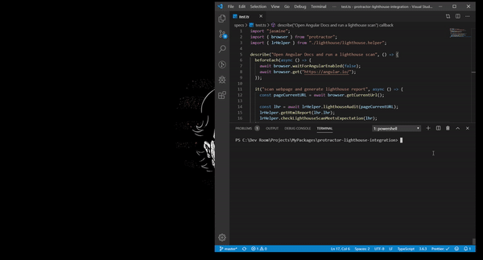

## Protractor Lighthouse Integration

Lighthouse is a tool developed by Google that analyzes web apps and web pages, collecting modern performance metrics and insights on developer best practices.

Basically, Lighthouse works with developer best practices and performance metrics. It runs checks on a web app and gives you feedback on errors, practices below standard, tips for better performance and how to fix them.

Before you start, please read the full blog [here](https://medium.com/@abhinabaghosh.1994/measure-your-websites-performance-with-google-lighthouse-and-protractor-1a6086267800)

### Setup Project

1. Install all necessary Dependencies

> npm install

2. Download webdriver binaries

> npm run setup

3. Run the test

> npm run test

#### Artifacts

Above commands will run the spec file and generate Lighthouse report as below:

Here is the HTML report out of it:

